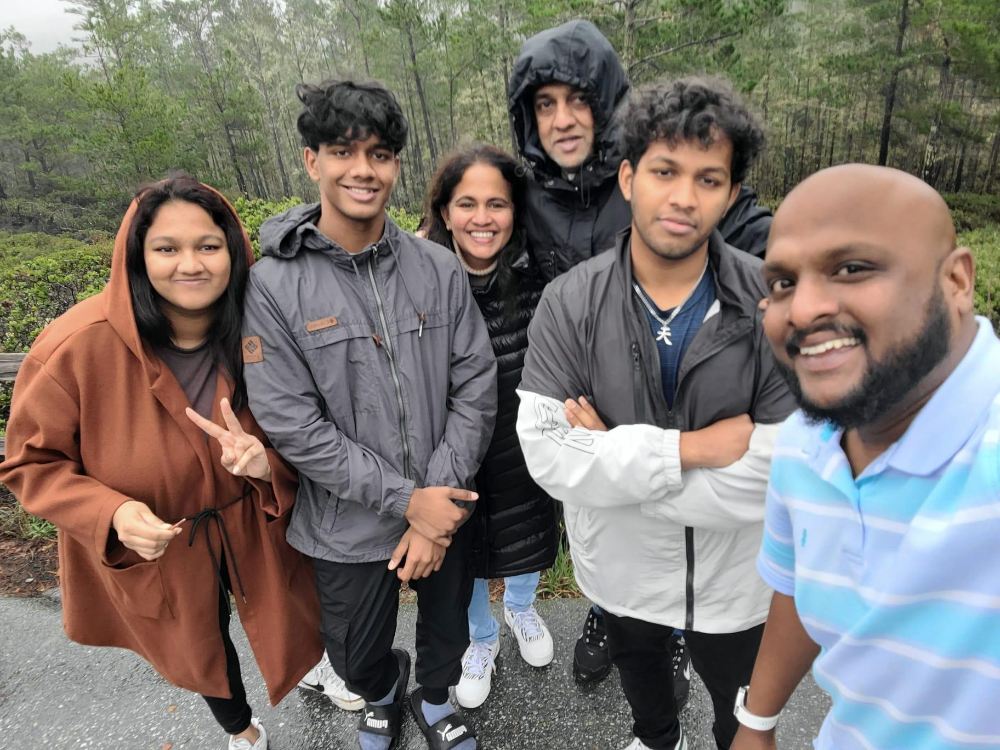

# **Pramesh's page**
## About me
Hey everyone. I'm Pramesh. I am a 4th year math-cs student and I'm really interested in cybersecurity and machine learning. My favorite programming language is C++



I also own a german shepard. Her name is Kai and I love her to death. Say hi to Kai   


## A quote I live by
> "Vincit qui se vincit"

### My plans 
- Graduate at the end of this quarter
- Visit Europe
- Get a job as a software engineer 
- Make a lot of money
- Buy a tesla
-Start my own company one day
- Change the world

### More fun facts about me
I am a big music nerd and I'm known for putting people on to good music :)  
My favorite Artists are
    1. Radiohead
    2. Kendrick Lamar 
    3. Mac Miller
   
 

I love to travel and explore the world  


Favorite places I've been to  
- San Francisco
- Japan
- Agra 


Im planning to visit Europe after I graduate. My plan is to hit up France and Italy. 


## Final Note
Thank you for checking out my page. If you want to connect with me   
Instagram: @pramesh_00  
[Linkedin](https://www.linkedin.com/in/pramesh-jalath-256b1a230/)
```
    cout << "Have a awesome day" << endl;
```